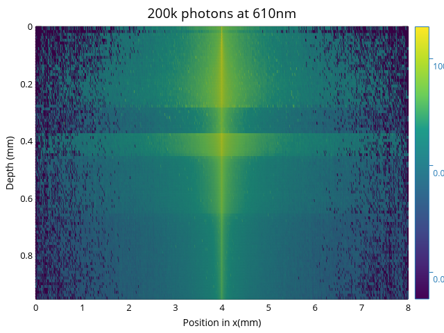

# montecarlo

Monte carlo simulation of photons propagation in skin

Anecdotally, the simulation time is reduced by over _400_ times vs an original model in `python`.

## Quick Start
```
>  montecarlo --help
Monte carlo simulation of photons propagation in skin

Usage: montecarlo [OPTIONS]

Options:
  -k, --kphoton <KPHOTON>        Number of 1'000s of photon to simulate [default: 100]
  -w, --wavelenght <WAVELENGHT>  Wavelength of the photons, in nm (many even ìnteger between 600 and 1000 allowed) [default: 700]
  -v, --verbose                  Verbosity
  -h, --help                     Print help

> montecarlo -k 200 -w 610
monte_carlo of 200k photons at 610nm finished on 12 cores in 483.192083ms
```


## License

Licensed under either of

 * Apache License, Version 2.0
   ([LICENSE-APACHE](LICENSE-APACHE) or <http://www.apache.org/licenses/LICENSE-2.0>)
 * MIT license
   ([LICENSE-MIT](LICENSE-MIT) or <http://opensource.org/licenses/MIT>)

at your option.

## Contribution

Unless you explicitly state otherwise, any contribution intentionally submitted
for inclusion in the work by you, as defined in the Apache-2.0 license, shall be
dual licensed as above, without any additional terms or conditions.
